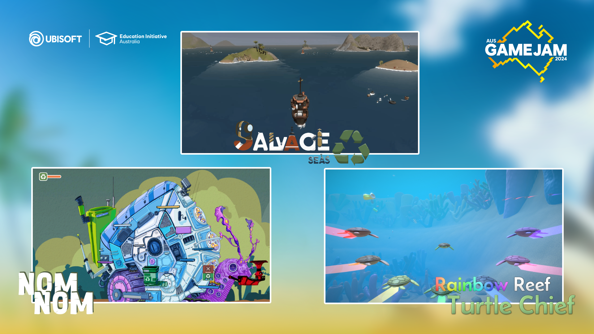
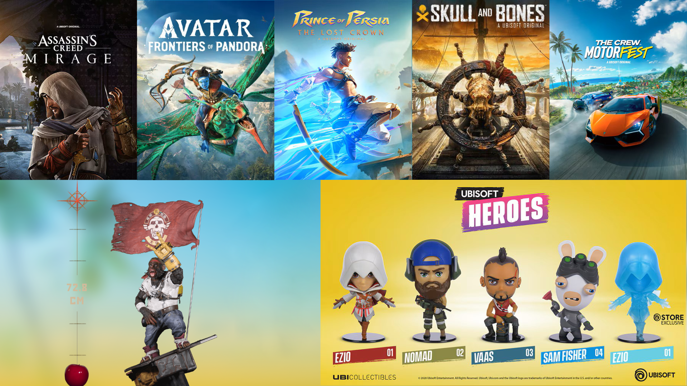
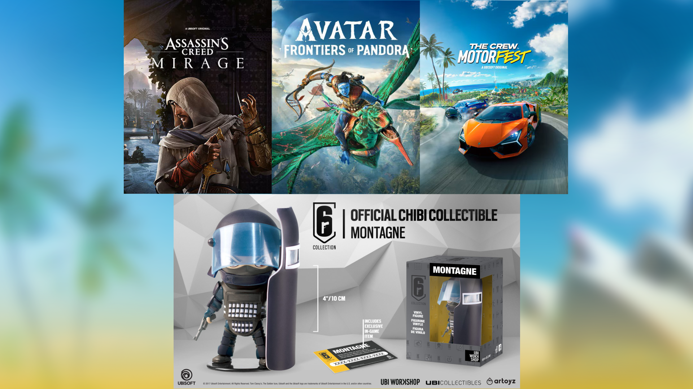
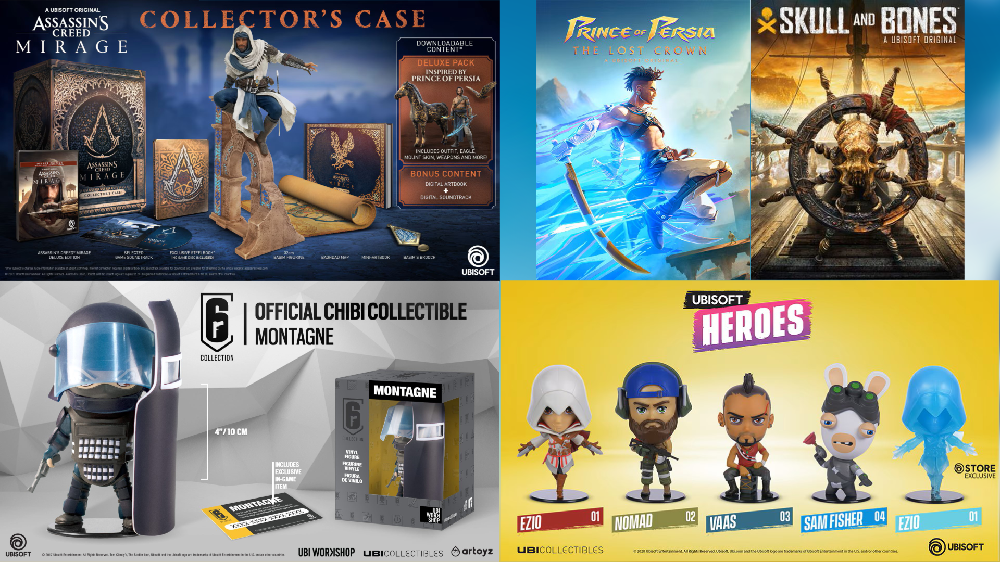

# Ubisoft Australia Game Jam

This is a new local game jam, it's too early to know if this will repeat with the consistency of Ludum Dare or Global Game Jam but it's still worth archiving!

## Rules

This may or may not change in future versions of the game jam.

### 2024 Ubisoft Australia Game Jam

- Exclusively for Australian residents aged 18 years and older, who are currently enrolled in an Australian University or TAFE degree with a valid .edu email address.
- Submissions must be made to the Itch.io page for this game jam.

## Per-Event Theme Information

### March 2024

'TRASH'

Ubisoft is committed to confronting climate change and developing internal and external initiatives to help the company and its communities to go green. Through events such as this, Ubisoft hopes to inspire players, creators and team members to address and tackle some of the environmental issues affecting our world.

In an effort to do something a little bit different, the team decided to flip the usual 'GREEN' theme upside down, and encourage participants to explore the issues that are faced by our local ecosystem and its unique inhabitants more directly.

We look forward to seeing how you choose to interpret and apply the Theme in your games! Good luck!

#### Winners

And The Winners Are... 🏆 🎉
Congratulations to the winners of the 2024 Ubisoft Australia Game Jam! 

**Overall Winner**: Salvage Seas by Salvage Company
https://erudiscent.itch.io/salvage-seas 

**Theme Winner**: Nom Nom by Siwei Luo, Xuange Sun, Qige Qi, Xiaojiang Zheng & Arwen Qin
https://h0lym0lyy.itch.io/nom-nom

**People's Choice Winner**: Rainbow Reef Turtle Chief by Team GCF
https://jaimeshirazi.itch.io/rainbow-reef-turtle-chief

Winners will be contacted shortly using the email addresses provided. 

Well done to everyone who participated, we hope you enjoyed the 2024 Ubisoft Australia Game Jam! 🙂

#### Prizes

##### Overall Winner - Prize Pack 🏆 🎁

Each member of the team behind Salvage Seas will be receiving a prize pack including:

- Limited Edition Beyond Good and Evil Knox Figurine (72.8cm tall)
- 2x Ubi Heroes Figurines (variety subject to availability)
- Ubisoft Digital Games Pack including:
 - Assassin's Creed Mirage - Deluxe Edition
 - Prince of Persia: The Lost Crown – Deluxe Edition
 - Skull and Bones - Premium Edition
 - The Crew Motorfest - Gold Edition
 - Avatar: Frontiers of Pandora - Standard Edition

##### Theme Winner - Prize Pack 🏆 🎁

Each member of the team behind Nom Nom will be receiving a prize pack including:

- 2x Rainbow Six Chibi Figurines (variety subject to availability)
- Ubisoft Digital Games Pack including:
 - Assassin's Creed Mirage - Deluxe Edition
 - The Crew Motorfest - Gold Edition
 - Avatar: Frontiers of Pandora - Standard Edition

##### People's Choice Winner - Prize Pack 🏆 🎁

Each member of the team behind Rainbow Reef Turtle Chief will be receiving a prize pack including:

- Assassin's Creed Mirage Collector's Case
- 2x Ubi Heroes Figurines (variety subject to availability)
- 1x Rainbow Six Chibi Figurines (variety subject to availability)
- Ubisoft Digital Games Pack including:
 - Prince of Persia: The Lost Crown – Deluxe Edition
 - Skull and Bones - Premium Edition

