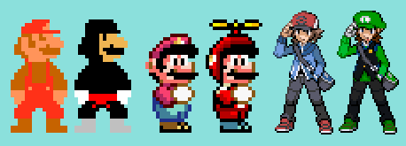
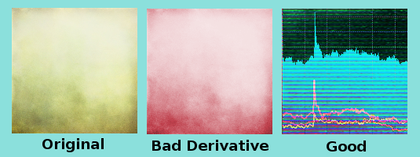
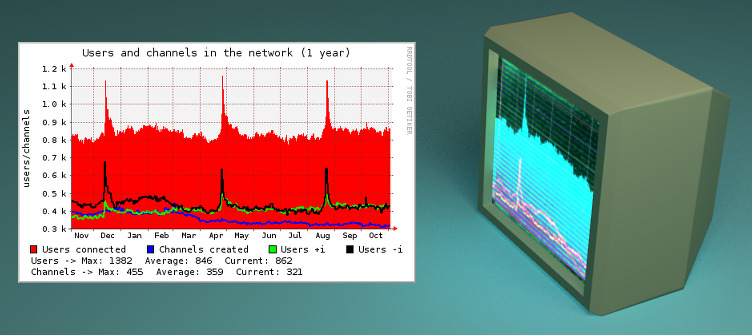
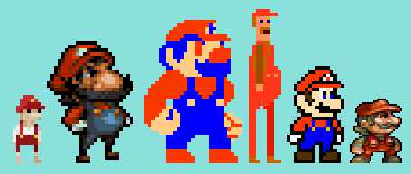
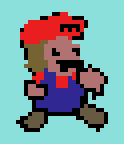

For the sake of this repository, we'll just keep the Ludum Dare dates & themes in a table here.

I (Bigfoot/Alex) haven't personally participated in these so I don't know if I'm missing additional info (eg. for comparison: Global Game Jam has a huge variety of modifiers per event, LD doesn't seem to do that?) but it looks like there's not really much info to archive per event when it comes to the event theme itself.

## Rules

~~If this info exists, it is not available as of 13th April 2024; [https://ludumdare.com/resources/rules](https://ludumdare.com/resources/rules)~~

Ludum Dare event rules are found here, and copied below for posterity in case their website changes or breaks again: [https://ldjam.com/events/ludum-dare/rules](https://ldjam.com/events/ludum-dare/rules)

Ludum Dare is an event where you create a game from scratch in a weekend based on a theme.

Themes are suggested and chosen by the community. Theme Suggestions are accepted starting 5 weeks before the event. Theme Voting kicks off 2 weeks before the event.

The theme is revealed at the start of the event.

Ludum Dare games are submitted to 1 of 2 categories: the Jam or the Compo.

### The Jam

The Jam is the Ludum Dare event for everyone. Teams, individuals, anyone that wants to come out and make something.

1. Work alone or in a team.
2. Create a game in 72 hours.

You’re free to use any tools or libraries to create your game. You’re free to start with any base-code you may have.

You’re free to use 3rd party Artwork/Music/Audio assets, or assets you previously created, but we ask that you OPT-OUT of the respected voting categories (Graphics, Audio). You can opt-out of a voting category when you submit your game.

We strongly recommend you only use assets that you have the legal right to use (Public Domain, things you licensed/created, etc). If you don’t have the right to use something, it is your responsibility.

#### Non-Video Game Entries

Board and Card game entries are allowed, but understand that they’re difficult to play (you often need a 2nd player). Games that are hard to play have a hard time getting ratings.

The ideal Ludum Dare game can be played right in the browser, in a few minutes, alone.

Coming Soon: We will soon allow non-game Craft entries. If you can’t make video games (or don’t want to), you’ll soon be able to submit other things. Comics, stuffed toys, short music albums, posters/wallpapers, cakes, short films, etc; Any creative project, inspired by Ludum Dare and the Theme. We’re not ready to open submissions to Craft entries, but stay tuned!

### The Compo

The Compo is Classic Ludum Dare. Another way to think of it is as Ludum Dare “Hard Mode”. Compo games are created entirely from scratch by one person, in just 48 hours. This is the ultimate test of your game creation skills.

1. You must work alone (solo).
2. Your game, all your content (i.e. Art, Music, Sound, etc) must be created in 48 hours.
3. Source code must be included.

You’re free to use any tools or libraries to create your game. You’re free to start with any base-code you may have. At the end, you will be required to share your source code.

TIP: Compo games are typically reviewed harsher than Jam games. If your game closely resembles a sample game that comes with a development tool, it probably wont get a good score. Be sure to fully customize, and make the game your own.

#### Source Code Explained

Sharing source is one of the ways we give back to the community. We’ve heard many stories of people getting in to game development thanks to the availability of Ludum Dare game source code. It used to be about fairness, but today we do it for them.

Source code is the stuff that makes your game a game. If you’re using a development tool without “code” (i.e. GameMaker), then as we see it, your “source code” is your project file.

Everything required to make the source work should be available publicly. If 3rd party libraries and tools are required, free or paid, that’s fine. If you’re using an internal library, to participate in the Compo, you will be required to share it.

If you are unable to share your code, we suggest you participate in the Jam instead.

#### Special Exemptions for the Compo

For all the following, you must have the legal right to use something.

- Fonts are allowed.
- A logo/intro screen for you/your brand is allowed (e.g. “by Super-Great Games”).
- Photos and recordings you make of people or things are allowed, just you must acquire them during the event.
- Content generators are allowed. In fact, they’re encouraged. sfxr, the popular sound effect generator was originally created for Ludum Dare.
- Texture masks, brushes, drums, loops, sampled instruments, and similar assets are allowed, but only if they are used to create a derivative work. i.e. a Song, a complex soundscape, a unique piece of artwork, etc. See below.

#### Derivative Works Explained

Derivative Works is a vague way to describe what we allow, but we don’t want to limit how you create your assets or visuals.

We don’t Police submissions, but do understand that participants criticize Compo games more harshly. They expect to see games created entirely from scratch. If it’s obvious that assets are borrowed and edited, your fellow participants may score you poorly.

Here are some bad derivatives (not necessarily bad looking):

You can easily see the silhouette and details of the original (left) in the derivative (right).

While this is technically a derivative, there’s a big problem: the original artwork belongs to Nintendo, who doesn’t grant permission to do this sort of thing (these are fan works, harmless, but still legally grey). If you plan to create artwork this way, you should enter the Jam instead.

Colorizing a grain texture is technically a derivative, but it’s not a very good one.

A better derivative uses the grain texture to add detail. For example, we start with a chart, blend it with a distorted version of the grain texture, apply a scanline post-process effect, and play with our levels. The result is something that could go on a CRT TV, health monitor, or anything Sciencey.

A good derivative transforms a work in to something new.

If you need to make reference to a well known character, then make the character your own.

Marios by: [Johan Peitz](https://ldjam.com/compo/author/johanp/), Jinn, fyaro2k, [Sos Sosowski](https://ldjam.com/compo/author/sos/), geno2925, and Jinn

Draw it to the best of your ability. Your fellow participants are mostly programmers, so don’t feel you need to make good art.

“Programmer Art” is welcome (and encouraged). 😀

Music is a highly derivative artform (I mean that in the best way possible). Songs are often constructed from samples, loops (repeating samples), virtual instruments (sometimes made of samples), or recordings (technically also a sample). Sampling is almost inescapable in music today.

To demonstrate, we’ll start with a set of audio samples:

[https://soundcloud.com/ludumdare/sets/derivative-work-example](https://soundcloud.com/ludumdare/sets/derivative-work-example)

Here is a song created using these samples:

[https://soundcloud.com/ludumdare/derivative-work-example-song-alarmed-by-kevin-bradshaw](https://soundcloud.com/ludumdare/derivative-work-example-song-alarmed-by-kevin-bradshaw)

Thanks to [Kevin Bradshaw](https://twitter.com/_Gaeel_) for making this.

### Additional Notes for both the Jam and Compo

- Both events have a Submission Hour that takes place at the end of each event (48, 72 hours later). This is an extra 1 hour for you to package-up and submit your game. In the case of the Compo: After that 1 hour, submissions for Compo will close, and you will have to submit your entry to the Jam.
- Porting (especially to Web or Windows) can happen after the initial 48 hours. The longer you wait though, the less time participants will have to play your game.
- Certain Bug Fixes are allowed. You can’t add new features, but if something broke or didn’t work correctly as you were finishing up, you can fix this after the deadline. You are asked to highlight the changes you make in your submission (a short change log). You probably wont get a 2nd chance with some players, but at least it wont be a problem for future players.

#### Submission

You will be uploading screenshots to the website, but you will have to upload and host your binaries elsewhere.

#### Ownership

Your game belongs to you. After all, you made it! Ludum Dare, its organizers and affiliates claim no rights or ownership of your game.

We do request the right to use your game for purpose of publicizing the event. If you do not wish your game to be publicized in this way, [tell Mike](https://ldjam.com/contact/).

#### Judging

All participants that submit a game are allowed to judge. Games are given 1-5 star ratings in each category, or N/A where not applicable. The categories include:

Innovation – The unexpected. Things in a unique combination, or something so different it’s notable.
Fun – How much you enjoyed playing a game. Did you look up at the clock, and found it was 5 hours later?
Theme – How well an entry suits the theme. Do they perhaps do something creative or unexpected with the theme?
Graphics – How good the game looks, or how effective the visual style is. Nice artwork, excellent generated or geometric graphics, charming programmer art, etc.
Audio – How good the game sounds, or how effective the sound design is. A catchy soundtrack, suitable sound effects given the look, voice overs, etc.
Humor – How amusing a game is. Humorous dialog, funny sounds, or is it so bad it’s good?
Mood – Storytelling, emotion, and the vibe you get while playing.
Overall – Your overall opinion of the game, in every aspect important to you.

In addition, there is a special category Coolness. The more games you play and rate, the higher your score. ALSO: we prioritize people with a higher Coolness. More players will find (and likely) rate your game if you have a high Coolness.

Coming Soon: We will soon have a system in place that credits you for leaving good feedback on a game. Details are still being worked out, but there will likely be Coolness bonuses.

Coolness Abuse: Beware! We monitor suspicious behaviour. We will not disqualify you, but any advantage you think you may be getting we can take away with just a few clicks.

#### Prizes

There are no physical or cash prizes for the competition. Your prize is your product.

That said, you have a game now. What are you going to do with it?

#### Is using the Theme required?

Officially no, you are not required to use the Theme. We will not disqualify you for disregarding it. To us, the Theme is just a single voting category. Ludum Dare is about encouraging you to make something. The theme is something we do to help everyone with the “[blank sheet of paper](https://en.wikipedia.org/wiki/Special:BlankPage)” problem that artists and creators deal with. It’s easier to make something with some direction than none.

That said, it’s worth understanding that all voting categories in Ludum Dare are opinions; The opinions of your peers. So while we don’t enforce that your game meets some minimum “themeyness”, the community does see significance in the Theme. So while we wont do anything about it, the community as a whole prefers games that do use the Theme. So as a general suggestion, if you want to score well in Ludum Dare, make sure you do use the theme in some way.

Using the Theme in Ludum Dare is a Social Rule, not a Legal Rule.

It is fine to prefer games that do use the Theme, but don’t be a rude about. A game made in a weekend doesn’t always turn out the way you hope.

#### “Post LD” Games

You’re encouraged to take your game above-and-beyond Ludum Dare. Our job is to encourage you to make a game, but after that it’s up to you.

We currently showcase Ludum Dare games available on [Steam](http://store.steampowered.com/curator/537829-Ludum-Dare/), and hope to showcase more “Post LD” games available on other platforms in the future.

## Per-Event Theme Information

This information is lifted from Wikipedia and trimmed down for focus;

- Source: [https://en.wikipedia.org/wiki/Ludum_Dare#Results](https://en.wikipedia.org/wiki/Ludum_Dare#Results)

| Event Number |        Month       |              Theme (bonus)             |
|:------------:|:------------------:|:--------------------------------------:|
| 0†           | April 2002         | Indirect interaction                   |
| 1            | July 2002          | Guardian                               |
| 1.5‡         | September 2002     | N/A                                    |
| 2            | November 2002      | Construction/destruction (sheep)       |
| 3            | April 2003         | Preparation – Set it up, let it go     |
| 4            | April 2004         | Infection                              |
| 5            | October 2004       | Random                                 |
| 6            | April 2005         | Light and darkness                     |
| 7            | December 2005      | Growth                                 |
| 8            | April 2006         | Swarms                                 |
| 8.5†‡        | January 2007       | Moon/anti-text                         |
| 9            | April 2007         | Build the level you play               |
| 10           | December 2007      | Chain reaction                         |
| 10.5‡        | February 2008      | Weird/unexpected/surprise              |
| 11           | April 2008         | Minimalist                             |
| 12           | August 2008        | The tower (owls)                       |
| 13           | December 2008      | Roads                                  |
| 14           | April 2009         | Advancing wall of doom                 |
| 15           | August 2009        | Caverns                                |
| 16           | December 2009      | Exploration                            |
| 17           | April 2010         | Islands                                |
| 18           | August 2010        | Enemies as weapons                     |
| 19           | December 2010      | Discovery                              |
| 20           | April 2011         | It's dangerous to go alone! Take this! |
| 21           | August 2011        | Escape                                 |
| 22           | December 2011      | Alone (kitten challenge)               |
| 23           | April 2012         | Tiny world                             |
| 24           | August 2012        | Evolution                              |
| 25           | December 2012      | You are the villain (goat)             |
| 26           | April 2013         | Minimalism (potato)                    |
| 27           | August 2013        | 10 seconds                             |
| 28           | December 2013      | You only get one                       |
| 29           | April 2014         | Beneath the surface                    |
| 30           | August 2014        | Connected Worlds                       |
| 31           | December 2014      | Entire Game on One Screen              |
| 32           | April 2015         | An Unconventional Weapon               |
| 33           | August 2015        | You are the Monster                    |
| 34           | December 2015      | Growing/two button controls            |
| 35           | April 2016         | Shapeshift                             |
| 36‡          | August 2016        | Ancient Technology                     |
| 37           | December 2016      | One Room                               |
| 38           | April 2017         | A Small World                          |
| 39           | July 2017          | Running out of Power                   |
| 40           | December 2017      | The more you have, the worse it is     |
| 41           | April 2018         | Combine two incompatible genres        |
| 42           | August 2018        | Running out of space                   |
| 43           | December 2018      | Sacrifices must be made                |
| 44           | April 2019         | Your life is currency                  |
| 45           | October 2019       | Start with nothing                     |
| 46           | April 2020         | Keep it alive                          |
| 47           | October 2020       | Stuck in a loop                        |
| 48           | April 2021         | Deeper and Deeper                      |
| 49           | October 2021       | Unstable                               |
| 50           | April 2022         | Delay the inevitable                   |
| 51           | October 2022       | Every 10 seconds                       |
| 52           | January 2023       | Harvest                                |
| 53           | April 28, 2023     | Delivery                               |
| 54           | September 29, 2023 | Limited space                          |
| 55           | April 13, 2024     | Summoning                              |
| 56           | October 5, 2024    | Tiny Creatures                         |
| 57           | April 5, 2025      | Depths                                 |
| 58           | October 13, 2025   | Collector                              |
| 59           | April 17, 2026     | Signal                                 |
| 60           | October ??, 2026   | TBD                                    |
| 61           | April ??, 2027     | TBD                                    |
| 62           | October ??, 2027   | TBD                                    |
| 63           | April ??, 2028     | TBD                                    |
| 64           | October ??, 2028   | TBD                                    |
| ENCORE       | April ??, 2029     | TBD                                    |

Notes:
- † — Competitions were held for only 24 hours.
- ‡ — Competition was run without ratings.

As per this blog post, Ludum Dare is due to wrap up officially with its 64th event, and have an unofficial encore event in April 2029. [https://ldjam.com/events/ludum-dare/59/$424396/ludum-dare-59-lives-me-too-countdown-to-64](https://ldjam.com/events/ludum-dare/59/$424396/ludum-dare-59-lives-me-too-countdown-to-64)